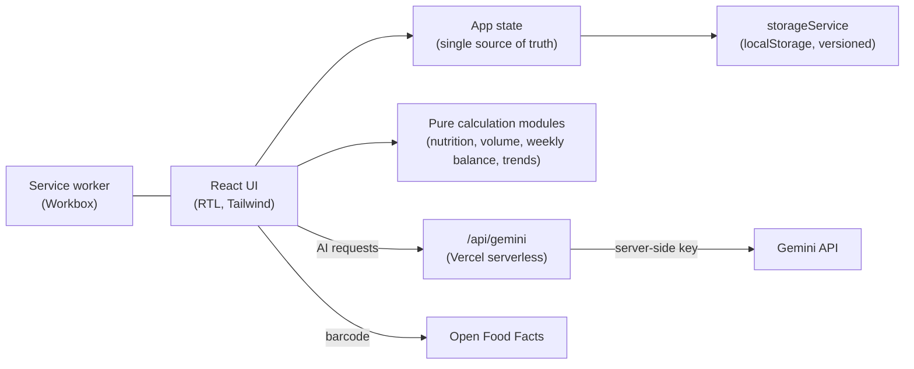

# MacroLift

**A local-first fitness & nutrition PWA in Hebrew (RTL): personalised calorie/macro targets, workout programs, weight-trend analysis and an AI coach, with all user data staying on the device.**

[](https://github.com/YShabtay/Macrolift/actions/workflows/ci.yml)
[](https://macrolift-one.vercel.app/)


**Try it:** <https://macrolift-one.vercel.app/> (open it on a phone and "Add to Home Screen"; there is also a one-tap demo user).

Built by a 3rd-year Industrial Engineering & Management student (Information Systems & Data Analytics tracks, Ariel University) as an end-to-end product project: from the nutrition model and UX, through offline-capable frontend engineering, to a secured serverless AI backend.

---

## Screenshots

<table>
  <tr>
    <td align="center"><br><sub><b>Welcome</b><br>guest, sign-in, restore from backup or demo user</sub></td>
    <td align="center"><br><sub><b>Dashboard</b><br>today's workout, weigh-in and daily insight</sub></td>
    <td align="center"><br><sub><b>Nutrition</b><br>calories and macros left, meals by day</sub></td>
  </tr>
  <tr>
    <td align="center"><br><sub><b>Workout</b><br>rest timer, A/B/C sessions and per-set logging</sub></td>
    <td align="center"><br><sub><b>Weight trend</b><br>weekly averages instead of daily noise</sub></td>
    <td align="center"><br><sub><b>AI coach</b><br>answers based on your plan and today's intake</sub></td>
  </tr>
</table>

---

## The problem

Most tracking apps share the same weaknesses:

- **Noisy data.** Daily weight swings of 1-2 kg (water, salt, digestion) make a single weigh-in meaningless, so people give up or panic.
- **Tedious logging.** Searching for every food item and weighing every gram does not last more than a couple of weeks.
- **Privacy.** Progress photos and body data end up on someone else's server.

## The approach

| Problem | What MacroLift does |
| --- | --- |
| Noisy weight | Rolling weekly averages and a trend line. The coach only comments after enough weigh-ins (3+ in each compared week) and never on a single day. |
| Tedious logging | A fast local database of Israeli staples, barcode scanning, voice logging, meal-photo scan, quick-add shortcuts, and Gemini as a fallback for anything else. |
| Rigid daily targets | Weekly calorie budget: a heavy day is balanced across the rest of the week instead of "failing" the day. |
| Privacy | No accounts and no database. Everything, photos included, is stored on the device, with JSON backup/restore for portability. |
| Generic training | Programs matched to days per week, gender and target-muscle focus, with weekly volume checked against the 12-16 sets/week range per muscle group. |

---

## Features

**Nutrition**
- Personalised targets: BMR by Mifflin-St Jeor (gender-specific), TDEE built from everyday life (1.4 x BMR, the lower bound of the FAO/WHO activity level for free-living adults) + walking beyond 4,000 steps (per step, scaled by body weight) + training, goal-based surplus/deficit and gender-aware macros. The calorie target is a **range**, not one number: because TDEE is an estimate (about 8% either way), a surplus goal starts from the low end and a deficit goal from the high end, so following the app cannot push anyone the wrong way if the estimate is off.
- **Weight-trend check (no food logging needed):** after two to three weeks of weigh-ins, the weekly average is compared with the pace the goal calls for; when it is clearly off, the app suggests adding or removing 100-300 kcal. The user can accept, change the amount or ignore it, and accepting moves the whole calorie range and macros and restarts the check. If logged food shows the target was simply not followed, it says so instead.
- **Personal calibration:** after about four weeks of food logging and weigh-ins, the app measures your real maintenance (average intake minus the energy in the weight change: about 7,700 kcal/kg for weight lost, less for weight gained since part of it is lean tissue) and suggests a correction to the formula, weighting it by how noisy the weight trend is.
- Food log by meal with per-meal macro summary, editable entries, natural serving units, and day-by-day navigation.
- Weekly calorie budget (with a recommended intake for today that uses the same step credit) and rebalancing options after an overshoot. The screens follow the clock, so a day change at midnight moves everything to the new day. The week is judged as a whole: an overshoot that the week's calorie balance so far already covers, after the week's walking is counted against the step goal (steps above it add calories, completed days below it take them away, counted once for the whole week), is shown as covered, with how many more kcal can be eaten and still stay balanced. The week's average steps are also compared with the step average the target assumes, and the app says how much more (or less) to eat when the person walks more (or less) than planned.
- Logging by search, barcode (camera, via Open Food Facts), voice, or a photo of the meal.

**Training**
- Built-in gym programs plus **home programs** (no equipment, or dumbbells and bands) at three levels, where the level picks a harder variation of each movement. Plus a custom plan builder, with a weekly volume view per muscle group.
- Guided workout mode: per-set logging, warm-up sets, plate calculator, rest timer (works in the background and with notifications).
- Exercise swap, exercise videos, workout calendar, streaks and a weekly summary with week navigation.

**Progress**
- Weight trend (weekly averages), circumference measurements, progress photos with side-by-side comparison, and an AI progress review.
- A coach that interprets the trend with conservative rules instead of reacting to noise.
- **Target weight** (optional): judged on the weekly average, with a progress bar from the starting weight, the kilos left and a rough time range (from the measured pace when the weigh-ins allow it, otherwise from the pace the goal plans). It is checked against the goal (a bulk cannot aim below the current weight), reaching it needs two weeks in a row at the target, and then the app offers to switch to maintenance instead of continuing to push the weight. It is kept in backups and given to the AI coach.

**AI coach** (Gemini)
- Chat that knows your profile, targets, today's intake, active plan and weight, and that continues the conversation instead of restarting every message.
- Meal photo analysis and voice-to-meal parsing.

**Product & reliability**
- Installable PWA with offline support, an install guide for iOS/Android, and background update checks with a "new version" prompt.
- Defensive data layer: schema versioning and migrations, sanitising of stored data on boot, per-screen error boundaries, and a recovery path if a chunk fails to load.
- Backup reminders, JSON export/import and CSV export.
- Automatic on-device safety copies in IndexedDB (daily, last 7 days, plus a copy before every reset, import or restore). They are offered for restore when the app opens with its data missing, reset can be undone in one tap, and a list in the profile restores any copy. Same-origin by design: they protect against mistakes and bugs, not against clearing all site data.

---

## Architecture



Design decisions worth knowing:

- **Local-first by choice.** All persistence goes through one abstraction (`src/services/storageService.ts`), so a backend can be added later without touching the UI. [`schema.sql`](schema.sql) sketches that target shape.
- **Logic is separated from UI.** Calculations live in small, pure modules under `src/utils` (for example `calculations.ts`, `weeklyBalance.ts`, `planVolume.ts`, `coachInsights.ts`), which keeps them easy to reason about and to test.
- **The AI key never reaches the browser.** In production every AI call goes through `api/gemini.ts`, a serverless proxy that holds the key server-side and enforces a model allow-list, request-size and token caps, a same-origin check and a per-IP rate limit. During local development the app calls Google directly with `VITE_GEMINI_API_KEY`, which is compiled out of production builds.
- **Heavy dependencies load on demand.** The barcode decoder (ZXing) is only fetched when the scanner opens.
- **The core logic is covered by unit tests** (see below), run on every push and pull request by GitHub Actions together with lint, type-check and the production build.
- **Resilience over cleverness.** Stored data is validated and migrated at boot (`dataMigration.ts`), and a bad entry degrades one screen rather than the whole app.

### Project structure

```
api/              Serverless Gemini proxy (Vercel)
src/components/   Screens and UI building blocks
src/services/     Storage, Gemini clients, barcode lookup
src/utils/        Pure logic: nutrition model, volume, trends, migrations
src/hooks/        Reusable hooks (install banner, visual viewport, ...)
src/data/         Workout templates, muscle labels and the local food database
```

---

## Testing

```bash
npm test
```

305 unit tests (Vitest) cover the logic where a silent mistake would give users wrong numbers, rather than the UI:

| Area | What is verified |
| --- | --- |
| Nutrition model (`calculations`) | Mifflin-St Jeor for both genders, TDEE as everyday life + walking above the baseline + training (every step beyond 4,000 and every session counts), plus a one-time recalculation when the model changes, every goal's calorie offset, the "never below BMR" floor, macro split that adds back to the target |
| Weekly balance (`weeklyBalance`) | Rebalancing a one-time overshoot across the remaining days, the safe-reduction cap, calories-to-steps conversion and step credits, the last day of the week |
| Training volume (`planVolume`) | Set-range classification, and that **every built-in program** keeps chest, back, quads and hamstrings in the 12-16 weekly-set range |
| Weight trend (`weightCalculations`, `coachInsights`) | Sunday-start weeks across month/year/DST boundaries, weekly averages, and the coach refusing to judge a week with too few weigh-ins |
| Data safety (`dataMigration`, `backupValidation`, `snapshotStore`) | Corrupt or partial stored data is cleaned entry by entry, sanitising is idempotent, malformed backup files are rejected or partially restored, snapshots are rate-limited, pruned per profile and skip empty profiles |
| Overshoot coverage and step credit (`overshoot`, `stepCredit`) | The week judged as a whole with one signed step credit shared by every calorie card: steps above the goal add, finished days below it subtract, the day in progress only adds, days without step data are skipped; covered by the weekly balance or by steps, the room left and the point where it runs out |
| Step surplus (`stepSurplus`) | The week's average steps against the average the target assumes: eat more when walking more, less when walking less, in kcal by body weight; quiet without two completed days or when the difference is small; slow days count against fast ones |
| Target weight (`weightTarget`) | Validation against the goal and BMI, progress on the weekly average, start weight bookkeeping, time estimate from the measured pace or the planned one, reached only after two weeks in a row, a trend moving away, survival through backup restore |
| Weight-trend check (`targetCheck`) | Waiting for enough weigh-ins, suggesting calories for a flat or too-fast weekly average per goal (bulk, cut), leaving an on-pace trend alone, not acting on a noisy one, telling apart a wrong target from an unfollowed one, applying and cancelling a correction |
| Calibration (`calibration`) | Measuring maintenance from intake and the weight trend, ignoring partly logged days and out-of-window data, asking for more data instead of guessing, trusting a noisy trend less, capping the correction |
| Home programs (`homeWorkoutTemplates`, `programSelection`) | Every equipment/level/frequency combination: only owned equipment, big muscles in an effective weekly range, no session overloading one muscle, swap options that suit the equipment |
| Utilities (`plates`, `chatFormat`) | Plate loading and warm-up ramps, Markdown clean-up for coach replies |

The tests were checked for real sensitivity by temporarily breaking the code (for example changing the lean-bulk surplus or the week start day) and confirming the right tests fail. Dates are pinned to one time zone so results don't depend on the machine.

---

## Run it locally

```bash
npm install
cp .env.example .env.local   # optional: add VITE_GEMINI_API_KEY to enable the AI features locally
npm run dev
```

| Command | What it does |
| --- | --- |
| `npm run dev` | Dev server |
| `npm run build` | Type-check and production build |
| `npm test` | Run the unit tests (Vitest); `npm run test:watch` re-runs them on save |
| `npm run lint` | Lint with oxlint |
| `npm run preview` | Serve the production build |

### Deploying (Vercel)

1. Import the repo; the framework preset is Vite.
2. Add `GEMINI_API_KEY` (**not** prefixed with `VITE_`) under *Settings -> Environment Variables*.
3. Set a quota or budget for the key in Google Cloud / AI Studio.

Without a key the app still works; only the AI features are unavailable.

---

## Limitations and next steps

- Data lives on a single device. Backup/restore covers moving between devices; optional cloud backup is the main candidate for a future version.
- The nutrition model gives estimates for healthy adults, not medical advice (the app shows a disclaimer).
